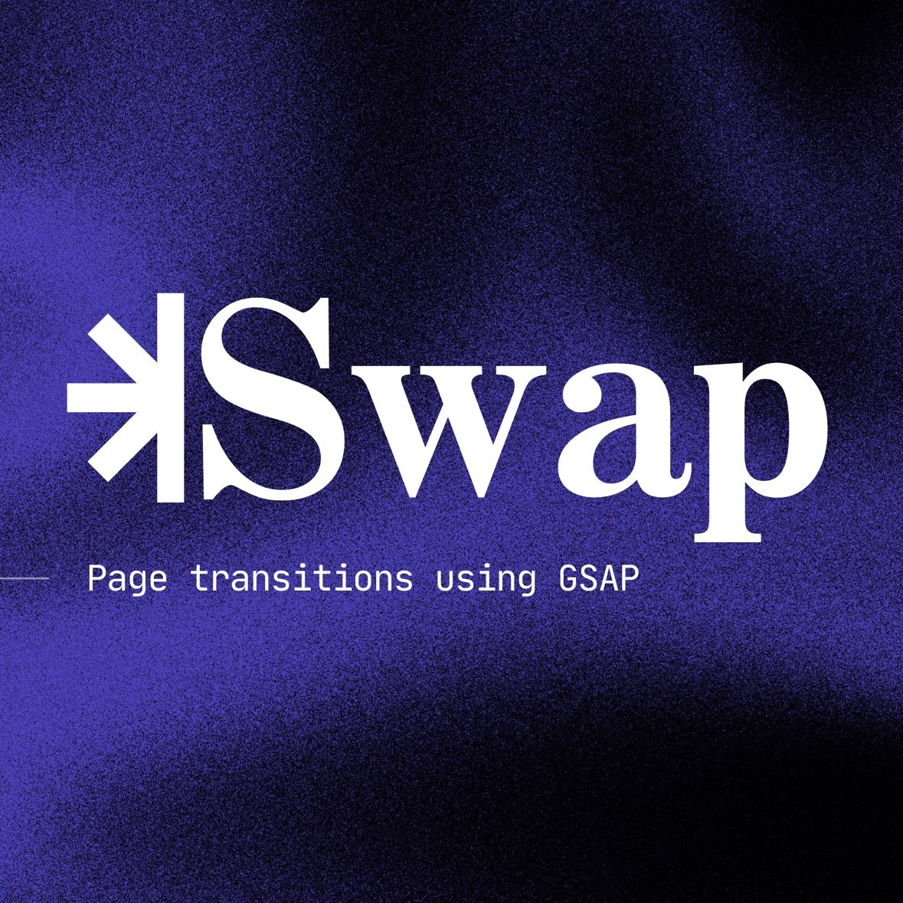

<p align="center">
  
</p>

<p align="center">
  <a href="https://jimmylatreille.github.io/swap/"><strong>🚀 Live Demo</strong></a>
</p>


# GSAP Page Transition Engine

> **100 Awwwards-grade, GPU-accelerated full-viewport page transitions** — built with pure JavaScript and GSAP 3. One dependency (GSAP). Fully bidirectional. Interrupt-safe.

---

## Table of Contents

1. [Demo](#demo)
2. [Features](#features)
3. [Requirements & Dependencies](#requirements--dependencies)
4. [Project Structure](#project-structure)
5. [Quick Start](#quick-start)
6. [API Reference](#api-reference)
   - [createTransition()](#createtransitioncontainer-options)
   - [Controller Methods](#controller-methods)
   - [Behaviour Notes](#behaviour-notes)
7. [Transition Variants](#transition-variants)
8. [The Layer System](#the-layer-system)
   - [CSS Layers](#css-layers)
   - [Dynamic Stripe DOM](#dynamic-stripe-dom)
9. [Customisation](#customisation)
   - [Colours & Theming](#colours--theming)
   - [Adding New Transitions](#adding-new-transitions)
10. [Integration Example](#integration-example)
11. [Accessibility](#accessibility)
12. [UI Controls](#ui-controls)
13. [Keyboard Shortcuts](#keyboard-shortcuts)
14. [Performance Notes](#performance-notes)
15. [Browser Support](#browser-support)
16. [Deployment](#deployment)
17. [Troubleshooting / FAQ](#troubleshooting--faq)
18. [Contributing](#contributing)
19. [Changelog](#changelog)
20. [Third-Party Licenses](#third-party-licenses)
21. [License](#license)

---

## Demo

**Live demo:** https://jimmylatreille.github.io/swap/

Or run it locally with any static file server (e.g. VS Code Live Server, `npx serve .`):

```bash
npx serve .
# → http://localhost:3000
```

---

## Features

| Feature | Detail |
|---|---|
| **100 unique variants** | Every conceivable transition style: wipes, irises, stripes, 3D flips, glitch, polygon morphs, elastic physics |
| **GPU-accelerated** | `force3D: true` on every timeline. Uses CSS `transform`, `clip-path`, and `filter` — nothing that triggers layout |
| **Bidirectional** | Every transition plays perfectly in both directions: `play()` and `reverse()` |
| **Interrupt-safe** | Call `reverse()` mid-`play()` — the animation reverses smoothly from wherever the playhead is |
| **Memory-safe** | All dynamically injected DOM nodes are tracked in a `cleanups[]` array and removed on `kill()` |
| **Single dependency** | Only GSAP 3 (loaded from CDN or bundled locally) |
| **Accessible** | Live region labels, `aria-hidden` management, keyboard navigation, reduced-motion aware |

---

## Requirements & Dependencies

The engine itself is plain browser JavaScript: **no build step, no bundler, no npm install**. Everything is loaded with classic `<script>` tags.

| Dependency | Version | File | Loaded by `index.html`? | Why it is there |
|---|---|---|---|---|
| **GSAP** (core) | `3.13.0` | `js/gsap.js` | ✅ Yes | **Required.** Every transition is a paused `gsap.timeline()`; `gsap.set()`, `gsap.killTweensOf()` and `gsap.utils.random()` are also used by the engine. |
| **SplitType** | `0.3.4` | `js/splitText.min.js` | ❌ No | Legacy helper used only by `js/text-anim.js`. Despite the file name, this is [SplitType](https://github.com/lukePeavey/SplitType) by Luke Peavey, **not** GSAP's SplitText plugin. |
| **jQuery** | `1.11.1` | `js/jquery.js` | ❌ No | Legacy helper used only by `js/text-anim.js`. |

What the engine actually needs at runtime:

- `gsap` available as a global (from `js/gsap.js` or a CDN).
- `js/transitions/utils.js` (exposes `window.TransitionUtils`).
- `js/transitions/create-transition.js` (exposes `window.PageTransitions`).
- A modern browser with `clip-path` and CSS custom property support (see [Browser Support](#browser-support)).

> **Note:** `js/text-anim.js` defines a `loadtext()` function that is never called by the demo. It also expects GSAP's **ScrollTrigger** plugin, SplitType and jQuery to be loaded. None of these are needed for the page transitions.

---

## Project Structure

```
swap/
├── index.html                   # Main demo page + documentation lightbox
├── .gitignore
├── README.md
├── swap-banner.jpg              # README banner image
│
├── img/                         # Logos, noise texture, background SVGs
│
├── css/
│   ├── reset.css                # Minimal CSS reset
│   ├── main.css                 # All UI styles + layer system + doc lightbox
│   └── page-transtion.css       # Legacy stripe loader styles (not linked by index.html)
│
└── js/
    ├── main.js                  # Demo orchestrator: cards, state machine, UI
    ├── noise.js                 # Canvas film-grain effect (24 fps)
    ├── gsap.js                  # GSAP 3.13.0 (local copy)
    ├── jquery.js                # jQuery 1.11.1 (legacy, not loaded by index.html)
    ├── splitText.min.js         # SplitType 0.3.4 (legacy, not loaded by index.html)
    ├── text-anim.js             # Legacy text animation helpers (not loaded by index.html)
    │
    └── transitions/
        ├── create-transition.js # ⭐ Core engine — all 100 transitions live here
        └── utils.js             # Shared DOM/GSAP utility helpers
```

> The demo page loads scripts in this order: `gsap.js` → `noise.js` → `transitions/utils.js` → `transitions/create-transition.js` → `main.js`.

---

## Quick Start

### 1. Include GSAP

Either via CDN (as in the demo):

```html
<script src="https://cdn.jsdelivr.net/npm/gsap@3.13.0/dist/gsap.min.js"></script>
```

Or use the local copy:

```html
<script src="js/gsap.js"></script>
```

### 2. Set up your HTML stage

The engine expects **4 stacked layer divs** inside the container it targets:

```html
<section id="preview-stage" class="preview-stage">
  <div class="transition-layer layer-bg"></div>
  <div class="transition-layer layer-accent"></div>
  <div class="transition-layer layer-overlay"></div>
  <div class="transition-layer layer-mask"></div>

  <!-- Your page content goes here -->
  <div class="preview-content">...</div>
</section>
```

### 3. Load the scripts and call

The engine exposes itself as a browser global — no bundler or ES modules needed:

```html
<script src="js/gsap.js"></script>
<script src="js/transitions/utils.js"></script>
<script src="js/transitions/create-transition.js"></script>
```

> **Load order matters.** `create-transition.js` reads `window.TransitionUtils` as soon as it loads, so `utils.js` must come **before** it, and GSAP must come before both. Put the scripts at the end of `<body>` (as the demo does) or add `defer` to all of them so the stage exists when your code runs.

```js
const { createTransition } = window.PageTransitions;
const stage = document.querySelector("#preview-stage");

// Create a controller for transition #12 (Scale Bloom)
const ctrl = createTransition(stage, { id: 12 });

// Play forward — covers the screen
ctrl.play();

// Reverse — uncovers the screen
ctrl.reverse();

// Cleanup — removes all injected DOM, kills GSAP timeline
ctrl.kill();
```

---

## API Reference

### `createTransition(container, options)`

The factory function. Builds the GSAP timeline for the selected variant and returns a controller object.

#### Parameters

| Parameter | Type | Required | Description |
|---|---|---|---|
| `container` | `HTMLElement` | ✅ | The element that hosts the 4 transition layers. Usually the full-screen stage. |
| `options.id` | `Number` | ❌ (defaults to `1`) | Transition index `1–100`. Selects the animation variant. See [Transition Variants](#transition-variants). |

#### Returns

A controller object with 3 methods and 1 read-only property:

| Member | Type | Description |
|---|---|---|
| `play()` | `() => void` | Plays the timeline forward. |
| `reverse()` | `() => void` | Plays the timeline backward. |
| `kill()` | `() => void` | Kills the timeline and removes injected DOM. |
| `isPlaying` | `boolean` (getter) | `true` while the timeline is actively animating (GSAP `tl.isActive()`); `false` when paused, finished, or killed. Always `false` in reduced-motion mode. |

> `isPlaying` can still be `false` immediately after `play()` is called, because GSAP only starts the timeline on its next tick.

### Controller Methods

#### `ctrl.play()`

Plays the timeline **forward** from the current playhead position.

- The transition layers animate **over** the viewport, covering the content.
- During coverage, you can safely swap your route, update DOM, or load a new page.
- Calling `play()` on a timeline that has already finished playing forward does **nothing** (the playhead is already at the end). Call `reverse()` first, or create a new controller to replay it.

```js
ctrl.play();
```

---

#### `ctrl.reverse()`

Plays the timeline **backward** from the current playhead position.

- The transition layers retract, revealing the underlying content.
- Fully interrupt-safe — can be called at any point during `play()`.
- When reversing, the demo headline text is automatically swapped back to its original state (see [Behaviour Notes](#behaviour-notes)).

```js
ctrl.reverse();
```

---

#### `ctrl.kill()`

Kills the GSAP timeline and runs all cleanup callbacks.

- Removes all dynamically injected DOM nodes (stripe overlays, wrappers).
- Leaves the layer elements in their last rendered state — the next `createTransition()` call resets them via its internal base-state setup.
- Should be called before creating a new transition to prevent memory leaks.

```js
ctrl.kill();
```

---

### State Machine Pattern (Recommended)

The demo uses this pattern internally for robust transition management:

```js
let activeCtrl = null;
let activeDir  = "play";

function runTransition(id) {
  // Kill the previous transition and clean up
  if (activeCtrl) activeCtrl.kill();

  // Create a fresh controller
  activeCtrl = createTransition(stage, { id });
  activeDir  = "play";
  activeCtrl.play();
}

function toggle() {
  if (!activeCtrl) return;
  if (activeDir === "play") {
    activeCtrl.reverse();
    activeDir = "reverse";
  } else {
    activeCtrl.play();
    activeDir = "play";
  }
}
```

---

### Behaviour Notes

These details come straight from `create-transition.js` and `utils.js`:

- **`id` must be a number.** The variant is selected with a strict `switch (id)`, so `{ id: "12" }` matches nothing. Convert strings first: `{ id: Number(value) }`.
- **Unknown IDs fail silently.** An `id` outside `1–100` (or `0`, since the default only applies to `null`/`undefined`) produces an empty timeline: `play()` and `reverse()` do nothing and no error is thrown.
- **`.layer-bg` and `.layer-mask` are mandatory.** If either is missing inside `container`, `createTransition()` throws `createTransition: .layer-bg or .layer-mask not found inside container.`
- **Content is collected at creation time.** `createTransition()` grabs `.preview-content > *` and `.preview-tags span` inside the container when it is called. Elements added later are not animated, so swap your content **before** creating the controller.
- **Every call resets the stage.** `createTransition()` kills any running tweens on the layers and content, then resets them to a neutral base state with `gsap.set()`.
- **Demo text swap.** The `stdContent()` helper inserts a timeline callback that rewrites the text of the page's `.eyebrow`, `.title` and `.copy` elements (found with `document.querySelector`, i.e. anywhere in the document, only when all three exist). This is a demo of a "content swap" and you will usually want to remove it in production. See [Troubleshooting](#troubleshooting--faq).
- **No callbacks or promises.** The controller does not expose `onComplete` events, promises, or the underlying timeline.

---

## Transition Variants

Pass the `id` to `createTransition()` to select a variant.

| ID | Name | Technique |
|---|---|---|
| 01 | Drift In | `clip-path` inset wipe from left + bg parallax slide |
| 02 | Rise Up | `clip-path` inset wipe from bottom |
| 03 | Slide Left | Full `translateX` panel slide |
| 04 | Drop Down | `clip-path` inset wipe from top |
| 05 | Unshutter | `scaleX` shutter reveal + opacity |
| 06 | Iris Expand | `clip-path circle()` expand from center |
| 07 | Split Center | Dual `clip-path` halves splitting apart |
| 08 | Blind Expand | 8 vertical stripes stagger in from bottom |
| 09 | Flicker Wipe | `clip-path` inset with opacity flicker on entry |
| 10 | Pull Through | `scaleX` + `yPercent` combined panel |
| 11 | Corner Iris | `clip-path circle()` expand from bottom-left corner |
| 12 | Scale Bloom | `clip-path circle()` + bg scale bloom |
| 13 | Poly Reveal | `polygon()` clip-path morph — diamond to full |
| 14 | Bottom Lift | Full `yPercent` panel lift from bottom |
| 15 | Curtain Down | `yPercent` curtain drop from top |
| 16 | Top-Right Iris | `clip-path circle()` expand from top-right |
| 17 | Overlay Wipe | `xPercent` full-screen panel sweep |
| 18 | Top Slice | `clip-path` inset horizontal slice |
| 19 | Scale Mask | Combined `scale` + `clip-path inset()` |
| 20 | Flash Sweep | Opacity flash + `xPercent` sweep |
| 21 | Diagonal Slash | Skewed `polygon()` diagonal wipe |
| 22 | Twin Curtain | Dual `yPercent` curtain halves |
| 23 | Ripple Burst | `clip-path circle()` expanding ripple wave |
| 24 | Page Curl | 3D `rotateY` perspective page curl |
| 25 | Depth Push | `translateZ` + `scale` depth push illusion |
| 26 | Cascade Drop | 12-stripe alternating `yPercent` cascade |
| 27 | Glitch Slam | `xPercent` + opacity glitch with `steps()` easing |
| 28 | Prism Slide | 8 horizontal stripes staggered |
| 29 | Elastic Gate | Dual `scaleX` gates with `elastic.out` |
| 30 | Grand Finale | 12-stripe alternating direction bounce |
| 31 | Cinematic Bars | 2 bars from top/bottom + background `blur()` |
| 32 | Hexagon Expand | 6-point `polygon()` morph to full screen |
| 33 | Venetian Blinds | 14 stripes with 3D `rotationX` flip (perspective) |
| 34 | Diagonal Stagger | 6 stripes rotated 45° stagger across |
| 35 | Cross Split | 12-point cross `polygon()` expand to full screen |
| 36 | Shutter Twist | 8 stripes `skewX` + `yPercent` stagger |
| 37 | Diamond Sweep | 4-point diamond `polygon()` wipe |
| 38 | Accordion Fold | Alternating-origin `scaleY` accordion fold |
| 39 | Center Pinch | `inset()` clip-path horizontal centre pinch |
| 40 | Orbital Sweep | `rotationZ` + `scale` spiral entrance |
| 41 | Glitch Slice | 5 stripes `xPercent` with `steps(4)` easing |
| 42 | Triangle Unfold | Triangle `polygon()` morph reveal |
| 43 | Elastic Drop | `inset()` clip-path with `bounce.out` physics |
| 44 | The Void | `inset()` + rotation + scale — sucked into void |
| 45 | Double Door Sweep | 2 panels `xPercent` then `yPercent` exit |
| 46 | Ripple Offset | 10 stripes expanding from center outward |
| 47 | Skewed Blocks | 6 stripes `yPercent` + `skewY` stagger |
| 48 | Iris Blink | Circle blink (close/open) + `bounce.out` reveal |
| 49 | Sawtooth Wipe | 9-point jagged polygon wipe across screen |
| 50 | The Masterpiece | 3D bg depth push + 10-stripe 3D shutter |
| 51 | Tidal Wave | sine-wave `polygon()` sweep across |
| 52 | Pixel Storm | 6×8 grid (48 cells) random-stagger in/out |
| 53 | Paper Fold | `inset` fold from bottom + skew |
| 54 | Cyclone Iris | spinning `circle()` iris reveal |
| 55 | Quadrant Bloom | 4 quadrants bloom from outer corners |
| 56 | Jelly Wipe | `inset` wipe + elastic accent jelly panel |
| 57 | Venetian Spin | 10 horizontal stripes 3D `rotationY` flip |
| 58 | Domino Fall | 12 vertical stripes `rotationX` domino topple |
| 59 | Ink Drop | `circle()` iris + `blur()` ink bleed |
| 60 | Shatter | 4×6 grid scatter in, fly-out |
| 61 | Liquid Pour | full panel `scaleY` elastic pour |
| 62 | Zoom Tunnel | `circle()` iris + bg scale pulse |
| 63 | Flip Book | 2 panels 3D `rotationY` book open |
| 64 | Neon Slash | glowing band expands to full cover |
| 65 | Gravity Drop | 8 stripes `bounce.out` drop |
| 66 | Split Horizon | horizontal `polygon()` split from middle |
| 67 | Spiral In | `inset` + rotation + scale spiral |
| 68 | Mosaic Flip | 4×6 grid 3D `rotationY` flip |
| 69 | Smoke Veil | `inset` wipe + `blur()` drift |
| 70 | Rubber Band | full panel `scaleX` elastic snap |
| 71 | Crossfade Zoom | opacity crossfade + slow zoom |
| 72 | Twist Cascade | 7 stripes alternating `skewX` cascade |
| 73 | Pendulum | narrow blade pendulum swing from top |
| 74 | Checkerboard | 8×8 grid center/edges stagger |
| 75 | Black Hole | spinning panel scale 0 → cover → evaporates |
| 76 | Slide Stack | 3 offset stacked sliding panels |
| 77 | Echo Trail | `inset` wipe + ghost stripe echoes |
| 78 | Diagonal Fold | 4-point `polygon()` corner fold |
| 79 | Meteor Strike | skewed panel diagonal slam |
| 80 | Grand Overture | 12-stripe 3D cascade + bg blur depth |
| 81 | Aurora Veil | 4 aurora bands sweep + wipe |
| 82 | Origami Fold | 8 stripes alternating 3D fold |
| 83 | Waterfall | 10 stripes pour down |
| 84 | Kaleidoscope | 3×3 grid rotate in/out |
| 85 | Paper Shredder | 16 thin stripes shred fall |
| 86 | Light Leak | blurred accent sweep |
| 87 | Venetian Horizon | 8 horizontal stripes 3D `rotationX` flip |
| 88 | Bubble Rise | 5×5 bubble cells float up |
| 89 | Diamond Storm | rotating diamond `polygon()` expand |
| 90 | Echo Zoom | `inset` zoom + bg pulse echo |
| 91 | Laser Grid | 3 glowing laser lines sweep |
| 92 | Fold Out | 2 halves 3D fold away |
| 93 | Ink Splash | 6×6 cells random-rotation splash |
| 94 | Time Warp | skew + stretch `blur()` warp |
| 95 | Static Burst | `steps()` glitch wipe + shake |
| 96 | Glacier | 3 slow heavy panels |
| 97 | Prism Burst | 10 stripes center-burst `scaleY` |
| 98 | Night Drive | fast horizontal streak |
| 99 | Bloom Rings | expanding neon rings + iris |
| 100 | Apotheosis | 16-stripe 3D + spiral + blur depth |

---

## The Layer System

Every transition stage requires **4 stacked rendering layers** inside the container. They are referenced inside the engine via `nodes.bg`, `nodes.accent`, `nodes.overlay`, and `nodes.mask`.

### CSS Layers

| Class | z-index | Default colour | Role |
|---|---|---|---|
| `.layer-bg` | auto (DOM order) | `var(--bg)` | Base background. Most transitions animate `scale`, `xPercent`, `yPercent`, or `rotation` on this layer to create a parallax backdrop. |
| `.layer-accent` | auto (DOM order) | `var(--primary-color)` at 85% opacity | A semi-transparent colour wash. Faded in via `accentFade()` helper to add brand colour depth over the bg. |
| `.layer-overlay` | 2 | `#222` | Solid colour layer. Currently only animated by T17 Overlay Wipe, which fades it in from `opacity: 0`. |
| `.layer-mask` | 5 | `#000` | The **primary** clip-path animation layer. Most iris/wipe/polygon transitions animate `clip-path` on this element. Starts off-screen (`inset(0 100% 0 0)`). |

### Dynamic Stripe DOM

Many transitions inject additional DOM nodes at runtime. This is handled internally by the `makeStripes()` factory:

```js
// Internal function signature:
makeStripes(container, count, color = "#030409", direction = "row")
```

| Parameter | Type | Default | Description |
|---|---|---|---|
| `container` | `HTMLElement` | — | Parent element to inject the stripe wrapper into. |
| `count` | `Number` | — | Number of stripe divs to generate. |
| `color` | `String` | `"#030409"` | Background colour of each stripe. |
| `direction` | `String` | `"row"` | `"row"` → vertical stripes side-by-side. `"column"` → horizontal stripes stacked. |

All injected wrappers and stripes are pushed into the internal `cleanups[]` array. They are removed from the DOM automatically when `kill()` is called.

---

## Customisation

### Colours & Theming

All visual colours are driven by CSS custom properties. Edit the `:root` block in `css/main.css`:

```css
:root {
  --primary-color: #9CEC5B;  /* Main accent — used for overlay layers and UI highlights */
  --bg:            #141414;  /* Dark background — used for bg and mask layers           */
  --accent:        #6b7dff;  /* UI accent colour — buttons, active states               */
  --accent-2:      #ff5f92;  /* Secondary UI accent                                     */
  --text:          #f8f9ff;  /* Primary text colour                                     */
  --muted:         #888888;  /* Secondary / subdued text                                */
}
```

### Adding New Transitions

1. Open `js/transitions/create-transition.js`.
2. Inside `buildTimeline()`, find the `switch(id)` statement.
3. Add a new `case N:` block following the existing pattern:

```js
// ── 101 · My Custom Transition ────────────────────────────
case 101: {
  // Optional: create stripe DOM
  const { wrap, stripes } = makeStripes(container, 8);
  cleanups.push(() => { if(wrap.parentNode) container.removeChild(wrap); });

  // Animate! Use any GSAP properties.
  tl.fromTo(stripes, { yPercent: -110 }, { yPercent: 0, duration: 0.6, stagger: 0.05, ease: "expo.out" }, 0)
    .to(stripes, { yPercent: 110, duration: 0.6, stagger: 0.05, ease: "power4.in" }, 0.8)
    .fromTo(bg, { scale: 1.1 }, { scale: 1, duration: 1.2, ease: "expo.out" }, 0.9);

  // Fade in accent colour
  accentFade(0.9);

  // Fade in content text
  stdContent(1.1);
  break;
}
```

4. Increment `TOTAL` in `js/main.js`:

```js
const TOTAL = 101; // was 100
```

5. Add the name to the `NAMES` array:

```js
"My Custom Transition", // 101
```

#### Key helpers available inside `buildTimeline()`

| Helper | Signature | Description |
|---|---|---|
| `accentFade` | `(startTime = 0) => void` | Fades in the `.layer-accent` element from `opacity: 0` to `0.78`. |
| `stdContent` | `(startTime = 0.22) => void` | Staggers in `contentItems` and `tags` with a premium `expo.out` + `back.out` easing. Also triggers the text swap mid-transition. |
| `makeStripes` | `(container, count, color, direction) => { wrap, stripes }` | Generates a flex stripe overlay and returns GSAP-targetable elements. `direction`: `"row"` → vertical stripes side-by-side, `"column"` → horizontal stripes stacked. |
| `makeGrid` | `(container, rows, cols, color) => { wrap, cells }` | Generates a `rows × cols` grid overlay (cells in row-major order) and returns GSAP-targetable elements. |
| `wavePoly` | `(front, amp = 9, teeth = 8) => "polygon(...)"` | Builds a sine-wave `polygon()` string for liquid wave wipes. Coordinates are rounded to integers so GSAP can interpolate them smoothly. |

#### Important rules for bidirectional stability

- ✅ **Always use `%` units** in `clip-path` values — never mix `px` and `%`
- ✅ **Match point counts** — polygon strings in `fromTo()` must have the same number of points
- ✅ **Use `fromTo()`** instead of chained `from()` → `to()` for reliable reverse
- ✅ **Push to `cleanups[]`** for any DOM you inject
- ✅ **Set initial states with `gsap.set()` before building the timeline** — never after tweens are added, or reverse will break

---

## Integration Example

> **Example only.** This is not part of the engine. It is a minimal sketch of a click-to-navigate single-page app built on the real API (`createTransition`, `play`, `kill`). Adapt the selectors to your markup.

```js
const { createTransition } = window.PageTransitions;
const stage   = document.querySelector("#preview-stage");
const content = stage.querySelector(".preview-content");
let ctrl = null;

document.addEventListener("click", async (event) => {
  const link = event.target.closest("a[data-transition]");
  if (!link) return;
  event.preventDefault();

  // 1. Fetch the next page and pull out its content
  const html = await fetch(link.href).then((res) => res.text());
  const next = new DOMParser()
    .parseFromString(html, "text/html")
    .querySelector(".preview-content");
  if (!next) return;

  // 2. Kill the previous controller (removes injected stripes/grids)
  if (ctrl) ctrl.kill();

  // 3. Swap the content BEFORE creating the controller:
  //    createTransition() collects `.preview-content > *` when it is called
  //    and animates those elements in.
  content.replaceChildren(...next.childNodes);

  // 4. Create and play the transition
  ctrl = createTransition(stage, { id: Number(link.dataset.transition) });
  ctrl.play();

  history.pushState({}, "", link.href);
});
```

```html
<a href="/about.html" data-transition="12">About</a>
```

Things to keep in mind:

- Remove (or rewrite) the demo text-swap callback inside `stdContent()`, otherwise it will overwrite your `.eyebrow`, `.title` and `.copy` text.
- Because the controller has no completion callback or promise, routers that expect a promise from their transition hooks (e.g. Barba.js, Swup) need a small change to the engine, such as returning the timeline or resolving a promise from `tl.eventCallback("onComplete", …)` inside `createTransition()`.
- If you need to swap DOM at the exact moment the screen is fully covered, the place to hook in is the `tl.add(() => { … })` callback at the top of `stdContent()`.

---

## Accessibility

### Reduced motion (built in)

The engine **does** respect `prefers-reduced-motion: reduce`. When the user has it enabled, `createTransition()` skips the GSAP timeline entirely and returns a no-motion controller instead:

| Method | Reduced-motion behaviour |
|---|---|
| `play()` | Instantly sets `.layer-mask` to `clip-path: inset(0 0 0 0)` (fully shown). No animation. |
| `reverse()` | Instantly sets `.layer-mask` back to `clip-path: inset(0 100% 0 0)` (hidden). |
| `kill()` | No-op (nothing was injected). |
| `isPlaying` | Always `false`. |

Notes:

- The preference is read **each time `createTransition()` is called**, so a change in OS settings applies to the next transition.
- In reduced-motion mode the demo's headline text swap does not run, and stripes/grids are never created.
- `css/main.css` also turns off CSS transitions on the cards, carousel, menu button and fullscreen button under `prefers-reduced-motion: reduce`.
- To test it, use your browser DevTools' rendering panel to emulate `prefers-reduced-motion: reduce`.

### Demo UI

- The transition label uses `aria-live="polite"` and `aria-atomic="true"`, so the selected transition is announced.
- Each card is a `<button>` with an `aria-label` such as "Play transition 12: Scale Bloom".
- The carousel toggle updates `aria-expanded`; the documentation panel is a `role="dialog"` with `aria-modal="true"` and toggles `aria-hidden`.
- `Escape` closes overlays (see [Keyboard Shortcuts](#keyboard-shortcuts)).

### Known gaps

- The film-grain canvas (`js/noise.js`) keeps animating at 24 fps even with reduced motion enabled.
- The carousel overlay's `aria-hidden="true"` is set in the HTML but is not updated when the carousel opens.
- The documentation dialog does not trap or restore keyboard focus.

**Suggestion (not in the code yet):** pause the grain for reduced-motion users by drawing one static frame instead of starting the loop at the bottom of `js/noise.js`:

```js
// Suggested change — replace the last line of js/noise.js
if (window.matchMedia("(prefers-reduced-motion: reduce)").matches) {
  generateGrain();              // draw a single static frame
} else {
  requestAnimationFrame(loop);  // animated grain
}
```

---

## UI Controls

### Transition Carousel (Right Side Button)

The pill-shaped **"Select a transition"** button on the right side of the screen opens a horizontal carousel overlay showing all 100 transitions as scrollable cards.

- **Select:** Click any card → immediately plays that transition
- **Toggle:** Click the active card again → reverses the animation
- **Close:** Click the backdrop or press `Escape`

### Transition Label (Bottom Left)

Displays the currently active transition ID and name, with two control buttons:

| Button | Action |
|---|---|
| **Play** | Plays the active transition forward from its current playhead position |
| **Reverse** | Plays the active transition backward from its current playhead position |

### Fullscreen (Top Right)

The four-arrow icon button toggles the browser's native Fullscreen API. Ideal for client presentations.

### Documentation (Bottom Right)

The file-stack icon button opens the in-app documentation lightbox — a tabbed reference panel with Overview, API, Transitions, Layer System, and UI Controls sections.

---

## Keyboard Shortcuts

| Key | Action |
|---|---|
| `Escape` | Closes documentation lightbox → then carousel overlay → then exits fullscreen (priority order) |

---

## Performance Notes

- **`force3D: true`** is injected into the GSAP timeline `defaults` object, forcing all animations to the GPU compositor thread.
- **`will-change: transform, opacity, clip-path`** is set on all layer elements in CSS to pre-promote them to their own compositor layers.
- **`contain: layout style paint`** and **`isolation: isolate`** are set on the stage container to create a strict paint boundary, preventing unnecessary repaints of surrounding content.
- **`backface-visibility: hidden`** prevents blurry sub-pixel rendering on 3D transforms in Safari.
- Transitions that use `filter: blur()` are the most expensive: T31, T50, T59, T69, T80, T86, T94 and T100. Use them sparingly on mobile.
- Grid-based variants inject many nodes at once (for example T74 Checkerboard creates an 8×8 grid of 64 cells, T52 Pixel Storm 48 cells). They are removed on `kill()`, so always kill the previous controller.
- The demo's film-grain background (`js/noise.js`) redraws a full-viewport `ImageData` on the CPU 24 times per second. It is decorative only; remove the `<canvas id="noise-bg">` and the `noise.js` script if you do not need it.

---

## Browser Support

| Browser | Support |
|---|---|
| Chrome / Edge 90+ | ✅ Full |
| Firefox 89+ | ✅ Full |
| Safari 15.4+ | ✅ Full (`clip-path` polygon requires 15.4+) |
| Safari < 15.4 | ⚠️ Polygon transitions degrade gracefully |
| Mobile Chrome / Safari | ✅ Full (tested on iOS 16+) |

> **Note:** Layer colours use plain hex values and CSS custom properties (`.layer-accent` is `var(--primary-color)` at `opacity: 0.85`), so no modern colour functions are required.

---

## Deployment

The project is 100% static, so it can be hosted anywhere that serves files.

**GitHub Pages (how the live demo is hosted):** the site is published from the root (`/`) of the `main` branch at https://jimmylatreille.github.io/swap/. Every push to `main` triggers a new Pages build; there is nothing to compile.

To set it up on a fork:

1. Go to **Settings → Pages**.
2. Under **Build and deployment**, choose **Deploy from a branch**.
3. Select `main` and `/ (root)`, then save.

**Any other static host** (Netlify, Vercel, Cloudflare Pages, S3, a plain web server): upload the repository as-is. Use no build command and set the publish directory to the repository root.

> All paths in `index.html` are relative (`css/…`, `js/…`), so the demo also works from a sub-path like `/swap/`.

---

## Troubleshooting / FAQ

**A coloured panel or stripes stay on screen after a transition finishes.**
The exit tween probably does not move the element fully outside the viewport. Remember that `xPercent`/`yPercent` are relative to the element's **own** size, not the viewport. A stripe that is one-third of the screen tall needs much more than `yPercent: 110` to leave. Commit `207700c` fixed exactly this for T45, T56, T65, T73, T75, T77 and T96, for example:
- T96 Glacier uses per-band distances `(3 - i) * 120`.
- T45 Double Door Sweep exits with `yPercent: ±220`.
- T56 Jelly Wipe overshoots to `xPercent: 135` so its skewed corners clear the screen.
- T75 Black Hole now collapses to `scale: 0` instead of staying black.

**Old stripes or grid cells pile up when I click quickly.**
Call `kill()` on the previous controller before creating a new one (see the [state machine pattern](#state-machine-pattern-recommended)). `createTransition()` resets the layers, but only `kill()` removes the DOM injected by the previous controller.

**`TypeError: Cannot read properties of undefined (reading 'collectNodes')`.**
`utils.js` was not loaded, or was loaded after `create-transition.js`. Load the scripts in this order: GSAP → `utils.js` → `create-transition.js`.

**`window.PageTransitions` is undefined / `gsap is not defined`.**
Check the script order and paths, and make sure your code runs after the scripts have loaded (end of `<body>` or `defer`).

**`createTransition: .layer-bg or .layer-mask not found inside container.`**
The element you passed does not contain the layer divs. Check the markup in [Quick Start](#2-set-up-your-html-stage).

**Nothing happens when I call `play()`.**
- The `id` might be a string or out of range (see [Behaviour Notes](#behaviour-notes)).
- The timeline might already be at the end. Call `reverse()` first or create a new controller.
- Your OS might have reduced motion enabled, in which case only the mask snaps into place.

**My page text gets replaced with "Seamless Page Load, Dynamic Content Swap".**
That is the demo content swap in `stdContent()`. It targets the first `.eyebrow`, `.title` and `.copy` in the document. Remove that `tl.add()` block, or rename your classes.

**Can I open `index.html` directly from disk (`file://`)?**
Usually yes. The demo uses plain classic scripts with no modules or `fetch`. A local server (`npx serve .`, VS Code Live Server) is still recommended, as noted in `index.html`, and is required for the [Integration Example](#integration-example) because it uses `fetch`.

---

## Contributing

Contributions are welcome. Please keep it dependency-free and build-free.

1. Fork the repo and create a branch from `main` (e.g. `feat/transition-101`, `fix/t65-exit`).
2. Run the demo locally with a static server (`npx serve .`).
3. When you add or change a transition:
   - Follow the [rules for bidirectional stability](#important-rules-for-bidirectional-stability).
   - Make sure every cover element **fully leaves the viewport** on exit (see Troubleshooting).
   - Test `play()`, `reverse()` mid-play, the same card clicked repeatedly, quickly switching between cards, and reduced-motion emulation.
   - Check desktop and mobile viewport sizes; percentage transforms scale with element size.
4. Keep the docs in sync: update `TOTAL` and `NAMES` in `js/main.js`, the [Transition Variants](#transition-variants) table in this README, and the documentation lightbox in `index.html`.
5. Commit text files as normal UTF-8 text. Never commit base64-encoded file contents (this broke the live site once; see the changelog). Check with `git diff` before pushing.
6. Open a pull request against `main` with a short description and, if possible, a screen recording of the transition.

---

## Changelog

Derived from the git history (newest first).

| Date | Change |
|---|---|
| 2026-10-01 | Fixed `README.md`, `index.html` and `create-transition.js`, which had been committed as raw base64 and broke the site (PR #1). |
| 2026-10-01 | Live demo link added to the README; transition docs refreshed. |
| 2026-10-01 | Fixed leftover cover panels on T45, T56, T65, T73, T75, T77 and T96 by making exit distances clear the viewport. |
| 2026-10-01 | Added the Swap banner image to the README. |
| 2026-10-01 | Added 20 new transitions (81–100); demo UI and docs updated for 100 transitions. |
| 2026-10-01 | Fixed documentation inaccuracies and layer debug colours. |
| 2026-10-01 | Added 30 new transitions (51–80); demo UI and docs updated for 80 transitions. |
| 2026-08-28 | Bug fixes. |
| 2026-04-30 | First commit. |

---

## Third-Party Licenses

- **GSAP** (`js/gsap.js`) is owned by Webflow and is **not** covered by this project's MIT license. Since Webflow acquired GreenSock, GSAP and all of its plugins (including SplitText, ScrollTrigger and MorphSVG) are free to use, including in commercial projects, under the GSAP Standard License: https://gsap.com/standard-license. The main restriction is that you cannot use GSAP in no-code visual animation builders that compete with Webflow.
- **jQuery 1.11.1** (`js/jquery.js`) is © the jQuery Foundation, see https://jquery.org/license (legacy file, not loaded by the demo).
- **SplitType 0.3.4** (`js/splitText.min.js`) is by Luke Peavey, see https://github.com/lukePeavey/SplitType (legacy file, not loaded by the demo).

---

## License

MIT — free to use, modify, and distribute.
